<div align="center">



<br>

<a href="https://skillssparx.com"></a>
<a href="https://skillssparx.com"></a>


</div>

## 👋 A little about me

I'm a **WordPress and WooCommerce developer** who turns business requirements into practical, maintainable software. I work across **PHP, JavaScript, and frontend development**, from custom themes to plugins, API integrations, and store automation.

My focus is making the difficult parts work together: **checkout rules, pricing logic, booking flows, product data**, and the services a business relies on every day.

```php
<?php
/**
 * Plugin Name: Ameer Hamza
 * Description: Turns business requirements into practical, maintainable software.
 * Version:     6+ years
 * Author:      Ameer Hamza · Based in Pakistan · Working with clients worldwide
 * Author URI:  https://skillssparx.com
 * Requires:    A real business problem
 */

add_filter( 'your_business_workflow', function ( $workflow ) {
    return hamza()->build( $workflow, [
        'plugins'      => 'custom, purpose-built',
        'woocommerce'  => [ 'checkout', 'pricing rules', 'product logic' ],
        'integrations' => [ 'REST APIs', 'webhooks', 'data sync' ],
        'handover'     => 'clear and documented',
    ] );
} );
```

## 🧰 What I build

<table>
<tr>
<td width="50%" valign="top">

### 🧩 Custom WordPress plugins

Purpose-built functionality, admin tools, calculators, and workflows that fit specific business requirements.

`Admin tools` `Calculators` `Custom workflows`

</td>
<td width="50%" valign="top">

### 🛒 WooCommerce development

Custom checkout experiences, pricing rules, product logic, and integrations for online stores.

`Checkout` `Pricing rules` `Product logic`

</td>
</tr>
<tr>
<td width="50%" valign="top">

### 🔗 APIs & automation

REST API integrations, webhooks, data synchronization, and connected workflows that reduce manual work.

`REST APIs` `Webhooks` `Data sync`

</td>
<td width="50%" valign="top">

### 🎨 Custom themes & interfaces

Responsive WordPress themes, Gutenberg layouts, and frontend experiences built with attention to detail.

`Responsive themes` `Gutenberg` `Frontend UI`

</td>
</tr>
</table>

## 🛠️ My toolkit

<div align="center">

<picture>
  <source media="(prefers-color-scheme: dark)" srcset="https://skillicons.dev/icons?i=wordpress,php,js,html,css,git,figma&amp;theme=dark">
  
</picture>

<br><br>


</div>


## 🚀 Selected work

<table>
<tr>
<td width="33%" valign="top" align="center">

### 🖨️ Raven 3D Tech

<sub>🇦🇺 AUSTRALIA · 3D PRINTING</sub>

WordPress and WooCommerce development for an Australian 3D printing brand.


<a href="https://raven3dtech.com.au/"></a>

</td>
<td width="33%" valign="top" align="center">

### 🏠 Greenrock Roofing

<sub>🇨🇦 CANADA · ROOFING</sub>

Custom website development for a Canadian roofing business.


<a href="https://greenrockroofing.ca/"></a>

</td>
<td width="33%" valign="top" align="center">

### ⚡ SkillsSparx

<sub>🌍 WORLDWIDE · DEV SERVICES</sub>

My development services and portfolio, all in one place.


<a href="https://skillssparx.com/"></a>

</td>
</tr>
</table>

## 🔭 Currently building



### CatalogPrep Tools &nbsp;

Tools to help store owners **prepare product data for import**. First up is the **WooCommerce CSV cleaner**:

- 🔍 **Product validation** to catch problems before the import does
- 💬 **Useful error messages** that say what's wrong and where
- 📦 **Simple and variable product data**, handled properly
- 🔒 **Private by design.** CSV processing runs in the browser, so product files stay on the user's device

## 🧭 How I work




<div align="center">

### 💬 Have a WordPress or WooCommerce challenge?

Let's turn it into a working solution.

<a href="https://skillssparx.com/"></a>

<sub>Custom plugins · WooCommerce · API integrations · Automation</sub>


</div>
